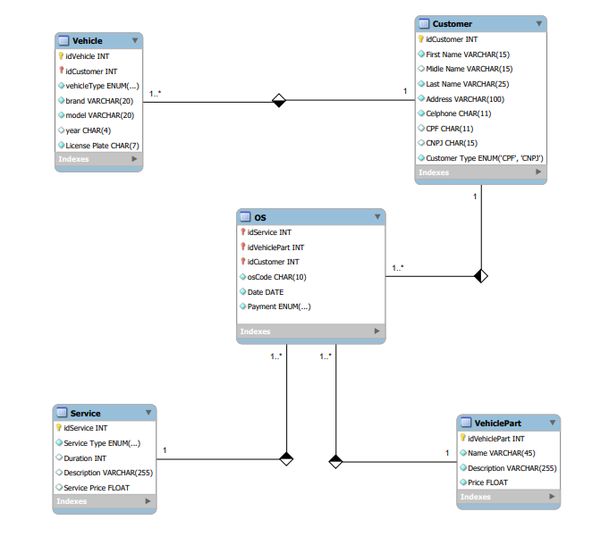

# Workshop

### Construa um Projeto Lógico de Banco de Dados do Zero

Este repositório foi desenvolvido para criar um esquema lógico para o contexto de uma oficina, cumprindo os desafios propostos pelo [Potência Tech powered by iFood | Ciência de Dados](https://web.dio.me/track/fd133067-6f2b-47c8-9763-edd87ec6b1cc).

O repositório está subdividodo em:
-  [WORKSHOP](https://github.com/LuuhMitre/workshop/blob/db2f29c75d421f53bcff4dd783e1839d29cbcc93/workshop.sql) - Esta etapa possui o código de criação do banco de dados
- [DATAS](https://github.com/LuuhMitre/workshop/blob/db2f29c75d421f53bcff4dd783e1839d29cbcc93/datas.sql) - Esta etapa possui os dados fictícios para a inserção ao banco de dados
- [QUERIES](https://github.com/LuuhMitre/workshop/blob/db2f29c75d421f53bcff4dd783e1839d29cbcc93/queries.sql) - Esta etapa possui queries de teste realizadas com os dados persistidos

